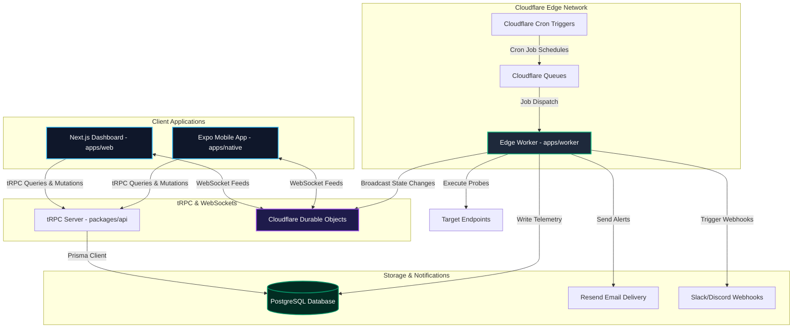
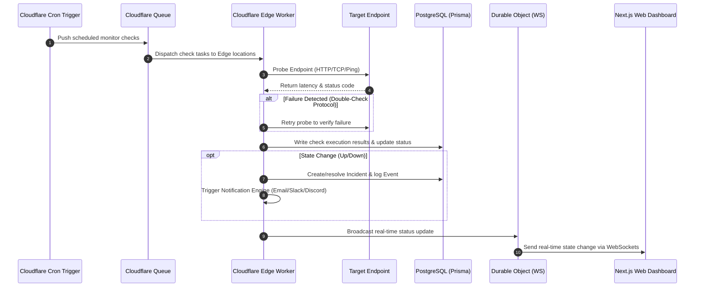

# PulseGuard

[](https://nextjs.org/)
[](https://workers.cloudflare.com/)
[](https://www.typescriptlang.org/)
[](https://www.prisma.io/)
[](https://tailwindcss.com/)
[](https://opensource.org/licenses/MIT)

> **An Enterprise-Grade Operational Intelligence Node for Modern Infrastructure.**

PulseGuard is a next-generation, edge-native website monitoring and uptime platform designed for developers who demand high reliability, microsecond accuracy, and professional monitoring with a cyberpunk-inspired interface.

Built using the **Better-T-Stack** (Next.js, tRPC, Tailwind, TypeScript), PulseGuard executes global latency probes and health checks across Cloudflare's edge network, broadcasting telemetry in real-time through WebSockets.

---

## ⚡ Key Capabilities

### 🛡️ Advanced Monitoring

- **Multi-Protocol Probes**:
  - **HTTP/HTTPS**: URL availability, custom headers, status-code validation, and precise TTFB/latency tracking.
  - **Ping/ICMP**: Network-level reachability, packet loss, and round-trip routing latency.
  - **Port/TCP**: Host service availability verification on specific ports (e.g., SSH, SMTP, custom APIs).
- **Multi-Region Probing**: Check service uptime from multiple geographic vantage points concurrently.
- **Intelligent Routing**: Latency probing and historical traffic patterns advise region selection.
- **Double-Check Protocol**: Automatic mitigation of false-positives via instant secondary verification loops.
- **Adaptive Check Intervals**: Support for polling frequencies ranging from 30 seconds down to 24 hours.

### 🔔 Intelligent Alerting

- **Omnichannel Notifications**:
  - **Email**: Transactional, responsive HTML notifications with auto-dark mode.
  - **Slack**: Rich payloads with interactive quick-action buttons.
  - **Discord**: Embed-structured webhook logs with color-coded severity.
- **Suppression & Rate-Limiting**: Intelligently throttles alerts during outages to prevent notification fatigue.
- **Flapping Detection**: Suppresses alerts when network noise triggers rapid state transitions.

### 📋 Incident Management

- **Automated Incidents**: Instantly tracks outages, generates incidents, and schedules notifications.
- **Lifecycle Tracking**: Moves monitors through standardized phases: `Investigating` ➔ `Identified` ➔ `Monitoring` ➔ `Resolved`.
- **Regional Isolation**: Tracks and reports localized failures without marking the entire global service down.
- **Audited History**: Paged telemetry trails detailing chronological failure states and status logs.

### 🔮 Cyberpunk UI/UX

- **Real-time Synchronization**: Live updates delivered instantly using Cloudflare Durable Objects over WebSockets.
- **Dynamic Visualizations**:
  - Neon-line charts tracking historical latency trends.
  - Latency heatmaps modeled after contribution graphs.
  - Real-time glow-based status indicators.
- **Unified Command Palette (`Cmd/Ctrl + K`)**: Keyboard-driven app traversal and monitor actions.
- **Pro Keyboard Shortcuts**: Full control with vim-like navigation (`j`/`k`), global filter (`/`), and rapid create (`c`).
- **Multi-Theme Hub**: Matrix Green, Cyberpunk Pink, and Blade Runner Orange.
- **Edge Accents**: Retrowave audio cues, custom scanlines, and digital glitch animations.

### 🔒 Resiliency & Enterprise Security

- **Better-Auth Authentication**: Session tracking, secure device registration, and native Two-Factor Authentication (2FA).
- **Smart Circuit Breaker**: Auto-escalates check intervals for chronically down endpoints to preserve edge CPU time.
- **Dead Letter Queues (DLQ)**: Retains failed monitor jobs for manual debugging.
- **Performance Batches**: Grouped processing limits CPU footprint and handles burst throughput efficiently.

---

## 🏗️ Architecture

PulseGuard is designed to be **serverless, edge-native, and zero-latency**.

### System Topology



### Telemetry Execution Flow



---

## 🛠️ Tech Stack

### Frontend & Mobile

- **Next.js 16** (App Router): Server Components & server-actions.
- **React 19**: Concurrent rendering architecture.
- **React Native & Expo**: Cross-platform native mobile clients.
- **Tailwind CSS v4**: High-performance CSS utility system.
- **Shadcn/UI & Radix**: Keyboard-accessible design primitives.
- **Recharts**: Low-latency SVG visualization library.

### Edge Backend & API

- **Cloudflare Workers**: High-density serverless edge computing.
- **Cloudflare Queues**: Reliable job buffering and asynchronous task scheduling.
- **Cloudflare Durable Objects**: State persistence for global real-time WebSockets.
- **tRPC (v11)**: End-to-end type safety without schema generators.
- **Zod**: Declarative data validation and parsing.

### Database & Security

- **PostgreSQL**: Transaction-safe relational database.
- **Prisma ORM**: Modern database access layer with migration engine.
- **Better-Auth**: Complete authentication framework with Multi-Factor (MFA) capabilities.

---

## 📁 Monorepo Structure

PulseGuard manages all components within a Turborepo monorepo structured as follows:

```yaml
pulseguard/
├── apps/
│   ├── web/             # Dashboard application (Next.js 16)
│   │   ├── src/app/     # Routing, Layouts & Server Actions
│   │   ├── components/  # Modular React visual components
│   │   └── wrangler.jsonc # Next.js OpenNext Cloudflare deployment config
│   ├── worker/          # Edge check execution engine (Cloudflare Worker)
│   │   ├── src/         # Probe logic, Queue handlers, and Durable Objects
│   │   └── wrangler.jsonc # Edge Worker infrastructure config
│   └── native/          # Mobile application (Expo Router)
├── packages/
│   ├── db/              # Database schema definition, migrations, and Client exports
│   │   └── prisma/      # Schema file and SQL migration scripts
│   ├── api/             # Type-safe tRPC Router registry and schemas
│   ├── auth/            # Better-Auth integration and security middleware
│   ├── email/           # HTML and template rendering pipeline (React Email)
│   ├── config/          # Centralized Shared TypeScript and Build configurations
│   ├── env/             # Runtime environment validation schema using Zod
│   ├── infra/           # Infrastructure-as-code scripts (Cloudflare provisioning)
│   └── shared/          # Universal helper functions and common types
```

---

## 🚀 Getting Started

### Prerequisites

- [Bun](https://bun.sh/) (v1.3.0 or later recommended)
- [Node.js](https://nodejs.org/) (v20+ recommended)
- A PostgreSQL instance (Local Docker container, Neon, or Supabase)

### Installation

1. **Clone the repository:**

   ```bash
   git clone https://github.com/your-username/pulseguard.git
   cd pulseguard
   ```

2. **Install monorepo dependencies:**

   ```bash
   bun install
   ```

3. **Configure Environment Variables:**

   Create a `.env` file in the project root (and local directories where required). Refer to the schema tables below.

   ```bash
   cp .env.example .env
   ```

### Database Initialization

Generate the Prisma Client and sync the schema with your PostgreSQL database:

```bash
bun run db:push
```

### Running Locally

To run the entire stack (Next.js web client, background workers, and Expo server) in development mode:

```bash
bun run dev
```

- **Web UI Dashboard**: `http://localhost:3000`
- **Prisma Studio**: `bun run db:studio` (Runs at `http://localhost:5555`)

---

## ⚙️ Configuration Reference

### Global Server Variables (`packages/env/src/server.ts`)

| Environment Variable       | Description                                                                 | Required | Default / Format                        |
| :------------------------- | :-------------------------------------------------------------------------- | :------- | :-------------------------------------- |
| `DATABASE_URL`             | Primary PostgreSQL database connection string.                              | Yes      | `postgresql://...`                      |
| `BETTER_AUTH_SECRET`       | Cryptographic key used to sign session cookies (min 32 chars).              | Yes      | High-entropy string                     |
| `BETTER_AUTH_URL`          | Canonical URL of the server-side authentication endpoint.                   | Yes      | `http://localhost:3000`                 |
| `CORS_ORIGIN`              | Allowed origin for inbound resource requests.                               | Yes      | `http://localhost:3000`                 |
| `NEXT_PUBLIC_APP_URL`      | Public-facing app URL (available client side).                              | Yes      | `http://localhost:3000`                 |
| `RESEND_API_KEY`           | Access token for email notification routing.                                | No       | `re_...`                                |
| `OPENAI_API_KEY`           | Optional key to compute smart probing and regional latency heuristics.      | No       | `sk-...`                                |
| `SLACK_SIGNING_SECRET`     | Secret to verify authenticity of Slack notifications & interactive buttons. | No       | Hex string                              |
| `UPSTASH_REDIS_REST_URL`   | Redis URL used for connection pooling fallback and cache pooling.           | No       | `https://...`                           |
| `UPSTASH_REDIS_REST_TOKEN` | Authentication token for Upstash Redis serverless REST interface.           | No       | JWT token                               |
| `NODE_ENV`                 | Running runtime lifecycle environment configuration.                        | No       | `development` \| `production` \| `test` |

---

## 🎮 CLI Script Registry

| Command               | Targets          | Description                                                        |
| :-------------------- | :--------------- | :----------------------------------------------------------------- |
| `bun run dev`         | Monorepo         | Boot up all apps in parallel hot-reload development mode           |
| `bun run dev:web`     | `apps/web`       | Run only the Next.js frontend web dashboard                        |
| `bun run dev:worker`  | `apps/worker`    | Spin up the monitoring Cloudflare Worker locally (using Miniflare) |
| `bun run dev:native`  | `apps/native`    | Launch the Metro bundler for the React Native/Expo app             |
| `bun run build`       | Monorepo         | Compile all code packages and deployable projects for production   |
| `bun run check`       | Monorepo         | Fast-check lint errors and auto-format (via Oxlint & Oxfmt)        |
| `bun run check-types` | Monorepo         | Type-check all workspace modules and apps via TypeScript           |
| `bun run db:push`     | `packages/db`    | Force synchronisation of Prisma Schema schema updates to DB        |
| `bun run db:migrate`  | `packages/db`    | Run standard production database migrations                        |
| `bun run db:studio`   | `packages/db`    | Open local browser dashboard for direct database management        |
| `bun run db:generate` | `packages/db`    | Recompile TypeScript bindings for the Prisma client                |
| `bun run deploy`      | `packages/infra` | Provision and deploy the Web and Worker stack to Cloudflare        |
| `bun run destroy`     | `packages/infra` | Tear down provisioned deployment resources                         |

---

## 🚀 Production Deployment

PulseGuard is configured to compile and run directly on **Cloudflare's serverless infrastructure**.

### Web App Deployment

1. Next.js is configured via **OpenNext** (`open-next.config.ts`) to output Cloudflare Pages assets.
2. Deploy directly via `wrangler` or connect your Git Repository to Cloudflare Pages for automated CI/CD builds.

### Worker Deployment

Deploy the global probe worker, bindings, and CRON triggers directly:

```bash
bun run deploy
```

> [!IMPORTANT]
> Verify your Cloudflare Wrangler credentials are authenticated (`npx wrangler login`) and that bindings matching your configuration exist on your account before running a deployment.

---

## 🗺️ Roadmap

### In Progress

- [ ] Public status pages with custom DNS mapping.
- [ ] Advanced check options (SSL certificate expiration warnings, DNS records, endpoint heartbeats).
- [ ] Role-Based Access Control (RBAC) and team invite hierarchies.
- [ ] Push notifications for the native mobile application.

### Planned

- [ ] Response body regex validation and content assurance checks.
- [ ] Automated domain registration and domain expiration tracking.
- [ ] Outage incident post-mortem templates.
- [ ] Custom Terraform / OpenTofu Provider for infrastructure-as-code monitor orchestration.
- [ ] CLI utility (`pulseguard-cli`) for monitor automation.
- [ ] SLA report exports (PDF / JSON metrics).

_See [TODO.md](TODO.md) for detailed task lists and feature backlog details._

---

## 🤝 Contributing

Contributions are welcome! Please follow these guidelines:

1. Fork the repository.
2. Branch out from `main` (`git checkout -b feature/awesome-feature`).
3. Maintain existing formatting and type standards. Run checks:
   ```bash
   bun run check
   bun run check-types
   ```
4. Commit your changes cleanly.
5. Submit a detailed Pull Request.

---

## 📄 License

Distributed under the MIT License. See [LICENSE](LICENSE) for more details.

---

## 💖 Acknowledgments

PulseGuard stands on the shoulders of these stellar modern libraries and platforms:

- [Next.js](https://nextjs.org/)
- [Cloudflare Workers](https://workers.cloudflare.com/)
- [Prisma](https://www.prisma.io/)
- [tRPC](https://trpc.io/)
- [Better-Auth](https://better-auth.com/)
- [Shadcn/UI](https://ui.shadcn.com/)
