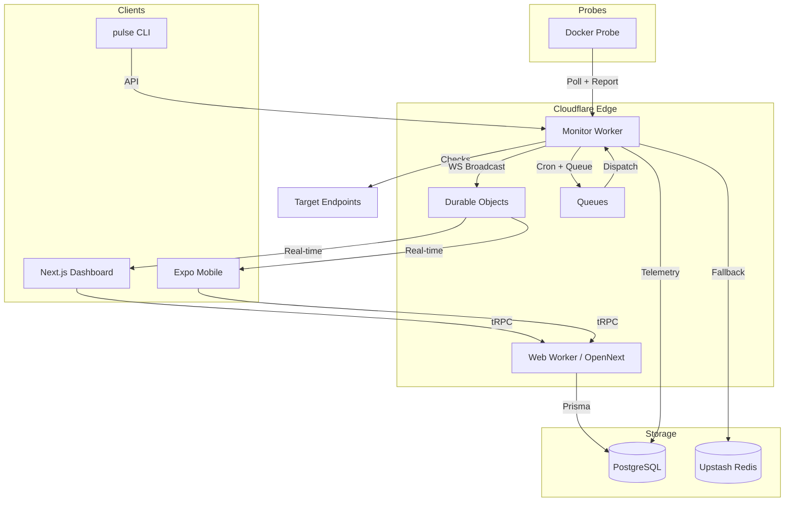

# PulseGuard

[](https://nextjs.org/)
[](https://workers.cloudflare.com/)
[](https://www.typescriptlang.org/)
[](https://www.prisma.io/)
[](https://trpc.io/)
[](https://bun.sh/)
[](https://tailwindcss.com/)
[](https://opensource.org/licenses/MIT)

> Edge-native operational intelligence platform for modern infrastructure.

PulseGuard is a serverless monitoring platform that runs on Cloudflare's edge network. It supports 16 monitor types, real-time WebSocket updates, private on-premise probes, public status pages, and multi-channel alerting — all behind a single Next.js dashboard.

---

## Features

### Monitoring

- **16 monitor types**: HTTP/HTTPS, PING, TCP Port, SSL/TLS, DNS record, Domain expiration, Browser (Puppeteer), Heartbeat, MCP, GraphQL, WebSocket, Database, BGP, SEQUENCE (multi-step browser scripts), PING, PORT
- **Multi-region probes**: Check from 50+ geographic locations across 7 continents
- **Adaptive intervals**: 30s to 24h per monitor
- **Double-check protocol**: Auto-retry from alternate vantage points before declaring downtime
- **Private probes**: Docker-based on-premise agents for internal network monitoring
- **WASM-accelerated payload validation**: Rust-compiled WebAssembly for regex + JSONPath response assertions

### Alerting & Incidents

- **Multi-channel notifications**: Email (React Email), Slack (interactive blocks), Discord (embedded embeds), Webhook, Telegram, SMS
- **Incident lifecycle**: `Investigating` → `Identified` → `Monitoring` → `Resolved` with full event audit trail
- **Post-mortems**: Root cause analysis documents with timeline, action items, and severity tracking
- **Regional isolation**: Track localized failures without global false-positives
- **Flapping detection & rate-limiting**: Suppresses noise during unstable periods

### Status Pages

- Public status pages with custom domains and password protection
- SEO indexing, custom CSS/JS, favicon, and OG images
- Subscriber management with email verification and per-monitor subscriptions
- Maintenance window scheduling
- Manual status overrides per day
- Multi-language support (i18n)

### Dashboard & Tools

- Real-time WebSocket updates via Cloudflare Durable Objects
- Latency heatmaps, uptime charts, and response-time graphs
- Command palette (Cmd/Ctrl+K) for keyboard-driven navigation
- **10+ free diagnostic tools**: SSL checker, DNS sentinel, port checker, HTTP security header analyzer, global latency probe, payload regex tester, IP subnet calculator, visual diff, cron sentinel, "roast my stack"

### CLI (`pulse`)

Monitoring as Code, CI/CD integration, and live debugging:

```bash
pulse auth login          # Authenticate with API key
pulse monitors apply      # YAML-based monitor sync
pulse trigger <id>        # Force immediate check
pulse logs <id>           # Tail events in real-time
pulse wait <id>           # CI/CD gate — blocks until UP or timeout
```

### API & SDK

- **tRPC v11**: End-to-end type safety from database to React components
- **REST endpoints**: Worker HTTP API for on-demand checks, DNS audit, SSL checks, etc.
- **WebSocket gateway**: Real-time monitor state via Durable Objects
- **API keys**: Scoped, hashed, with expiry

---

## Architecture



[Full architecture details →](./ARCHITECTURE.md)

---

## Tech Stack

**Frontend**: Next.js 16 (App Router), React 19, Tailwind CSS v4, shadcn/ui, Framer Motion, Recharts, TanStack React Query

**Edge**: Cloudflare Workers, Durable Objects, Queues, KV, Cron Triggers, OpenNext

**Backend**: tRPC v11, Zod, Prisma ORM, PostgreSQL (Supabase/Neon), Upstash Redis

**Auth**: better-auth (email/password, sessions, API keys, Expo integration)

**Mobile**: Expo SDK 54, React Native, expo-router

**Infrastructure**: Turborepo, Bun 1.3, Docker, WASM (Rust + wasm-bindgen)

---

## Monorepo Structure

```
pulseguard/
├── apps/
│   ├── web/              # Next.js dashboard + status pages + tools
│   ├── worker/           # Cloudflare Worker monitoring engine
│   ├── cli/              # pulse CLI (Monitoring as Code)
│   ├── native/           # Expo mobile app
│   ├── probe/            # Docker-based private probe
│   └── e2e/              # Playwright end-to-end tests
├── packages/
│   ├── api/              # tRPC router definitions
│   ├── auth/             # better-auth configuration
│   ├── config/           # Shared tsconfig
│   ├── core/             # Universal check primitives (HTTP, TCP)
│   ├── db/               # Prisma schema + client
│   ├── email/            # React Email templates (Resend)
│   ├── env/              # T3 env validation (Zod)
│   ├── infra/            # Cloudflare deployment (Alchemy)
│   ├── shared/           # Regions, limits, stack templates
│   ├── types/            # Shared TypeScript types
│   └── wasm-parser/      # Rust WASM payload validator
```

---

## Getting Started

### Prerequisites

- [Bun](https://bun.sh/) 1.3+
- [Node.js](https://nodejs.org/) 20+
- PostgreSQL instance (local Docker, [Neon](https://neon.tech/), or [Supabase](https://supabase.com/))

### Setup

```bash
git clone https://github.com/your-username/pulseguard.git
cd pulseguard
bun install
cp .env.example .env
# Edit .env with your database URL and auth secret
bun run db:push
bun run dev
```

- Dashboard: `http://localhost:3000`
- Prisma Studio: `bun run db:studio` → `http://localhost:5555`

### Environment Variables

See `packages/env/src/` for Zod-validated schemas. Key variables:

| Variable | Required | Description |
| :------- | :------- | :---------- |
| `DATABASE_URL` | Yes | PostgreSQL connection string |
| `BETTER_AUTH_SECRET` | Yes | Session signing key (min 32 chars) |
| `BETTER_AUTH_URL` | Yes | Auth base URL |
| `NEXT_PUBLIC_APP_URL` | Yes | Public app URL |
| `CORS_ORIGIN` | Yes | Allowed CORS origin |
| `RESEND_API_KEY` | No | Email delivery |
| `UPSTASH_REDIS_REST_URL` | No | Redis fallback |
| `OPENAI_API_KEY` | No | Anomaly detection |

---

## Scripts

| Command | Description |
| :------ | :---------- |
| `bun run dev` | Start all apps in dev mode |
| `bun run dev:web` | Next.js dashboard only |
| `bun run dev:worker` | Cloudflare Worker (Miniflare) |
| `bun run dev:native` | Expo Metro bundler |
| `bun run build` | Build all packages |
| `bun run check` | Lint + format (oxlint + oxfmt) |
| `bun run check-types` | TypeScript type check |
| `bun run db:push` | Sync Prisma schema to DB |
| `bun run db:migrate` | Run production migration |
| `bun run db:studio` | Open Prisma Studio |
| `bun run db:generate` | Recompile Prisma client |
| `bun run deploy` | Deploy to Cloudflare |
| `bun run destroy` | Tear down Cloudflare stack |

---

## Deployment

PulseGuard deploys to Cloudflare's serverless platform:

- **Web**: Next.js compiled via OpenNext → Cloudflare Pages
- **Worker**: Cloudflare Worker with Cron Triggers, Queues, and Durable Objects
- **Probe**: Docker image (`pulseguard-probe`) for customer infrastructure

```bash
npx wrangler login       # Authenticate with Cloudflare
bun run deploy           # Deploy web + worker
```

See `packages/infra/` for Alchemy-based deployment configuration.

---

## Roadmap

- [ ] Team management and RBAC
- [ ] Native mobile push notifications
- [ ] Terraform/OpenTofu provider for Monitoring as Code
- [ ] SLA report exports (PDF, JSON)
- [ ] PagerDuty and Opsgenie integrations
- [ ] Synthetic transaction scripting (multi-step browser flows)

---

## Contributing

1. Fork and branch from `main`
2. Run `bun run check && bun run check-types` before committing
3. Submit a detailed pull request

---

## License

MIT — see [LICENSE](LICENSE)
