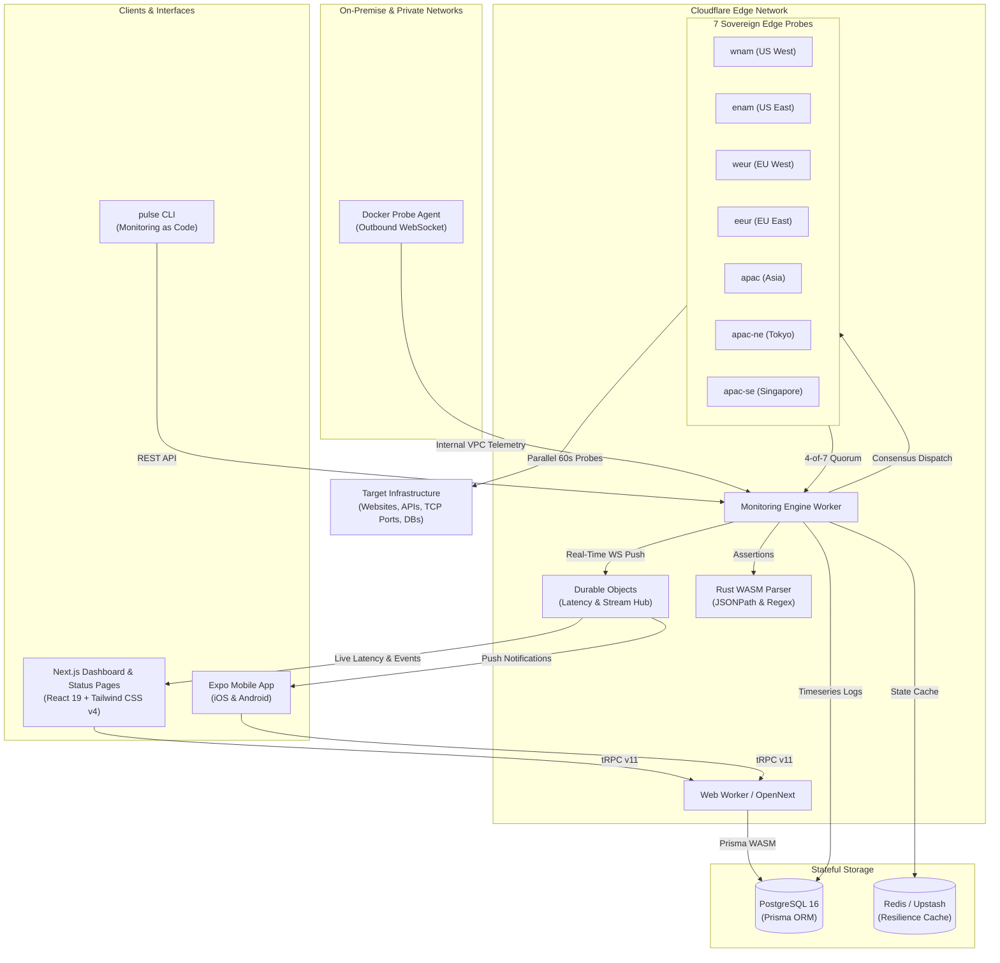

<div align="center">

# SteadyStack ⚡

**Edge-native, zero-false-positive operational intelligence platform for modern infrastructure.**

[](https://steadystack.dev/status-page/steadystack)
[](https://nextjs.org/)
[](https://workers.cloudflare.com/)
[](https://www.typescriptlang.org/)
[](https://www.prisma.io/)
[](https://trpc.io/)
[](https://bun.sh/)
[](https://tailwindcss.com/)
[](./docs/self-hosted.md)
[](https://opensource.org/licenses/MIT)

<br />

[**🚀 Quickstart**](#-getting-started) •
[**🐳 Self-Host Guide**](#-self-host-in-60-seconds) •
[**🔄 Uptime Kuma Importer**](#-one-command-uptime-kuma-migration) •
[**⚖️ vs Uptime Kuma**](#-steadystack-vs-uptime-kuma-an-honest-comparison) •
[**🗺️ Public Roadmap**](./ROADMAP.md) •
[**💬 Discussions**](https://github.com/getsteadystack/SteadyStack/discussions)

</div>

---

## ⚡ Why SteadyStack?

Traditional monitoring tools force you into a frustrating tradeoff: either pay exorbitant per-seat SaaS prices for basic 5-minute ping checks, or run a single-box open-source container that wakes you up at 3:14 AM because of a localized ISP glitch.

SteadyStack combines the **sovereignty of open source** with the **power of global edge consensus**:

```
┌─────────────────────────────────────────────────────────────────────────────┐
│  SteadyStack Multi-Region Edge Quorum Consensus                              │
│                                                                             │
│  [wnam]  [enam]  [weur]  [eeur]  [apac]  [apac-ne]  [apac-se]               │
│    │       │       │       │       │        │          │                    │
│    └───────┴───────┴───────┼───────┴────────┴──────────┘                    │
│                            │ (Parallel 60s Health Checks)                   │
│                            ▼                                                │
│              [4-of-7 Quorum Consensus Engine]                               │
│                            │                                                │
│         ┌──────────────────┴──────────────────┐                             │
│         ▼                                     ▼                             │
│   [Majority Verified]                   [Minority Blip]                     │
│   ➔ Incident Paged (Real Outage)        ➔ Regional Degradation (No 3AM Ping)│
└─────────────────────────────────────────────────────────────────────────────┘
```

1. **60-Second Checks Standard**: 1,440 data points per day per target vs the legacy 288 checks from 5-minute tools.
2. **7-Region 4-of-7 Quorum Consensus**: Checks run in parallel across North America, Europe, and Asia-Pacific. No false alarms from single-node packet loss.
3. **Monitoring as Code (`pulse` CLI)**: Declarative YAML monitor definitions, GitOps sync, and CI/CD deployment blocking gates.
4. **Rust WASM Payload Validator**: Instant regex and JSONPath response assertions compiled to WebAssembly.
5. **Zero Vendor Lock-In**: Export anytime to Uptime Kuma, OpenStatus, or Prometheus Blackbox exporter YAML.

---

## 🖥️ Live Terminal & Engine Demo

```
$ pulse monitors list
┌────────┬─────────────────────────────┬──────────┬──────────────────────────────────────────┬──────────┬────────────┐
│ STATUS │ NAME                        │ TYPE     │ URL                                      │ INTERVAL │ LAST CHECK │
├────────┼─────────────────────────────┼──────────┼──────────────────────────────────────────┼──────────┼────────────┤
│ UP     │ Production API Gateway      │ HTTP     │ https://api.steadystack.dev/health         │ 60s      │ 13:49:12   │
│ UP     │ Auth Service Edge           │ HTTP     │ https://auth.steadystack.dev/api/health    │ 60s      │ 13:49:08   │
│ UP     │ Primary PostgreSQL Cluster  │ DATABASE │ pg.internal.steadystack.dev:5432           │ 30s      │ 13:49:15   │
│ UP     │ WebSocket Real-Time Gateway │ WEBSOCKET│ wss://ws.steadystack.dev/v1/stream         │ 60s      │ 13:49:01   │
│ UP     │ European DNS Sentinel       │ DNS      │ ns1.steadystack.dev                        │ 120s     │ 13:48:30   │
└────────┴─────────────────────────────┴──────────┴──────────────────────────────────────────┴──────────┴────────────┘
  5 monitors total (Verified by 7 Cloudflare Edge Regions)

$ pulse import kuma uptime-kuma-backup.json
✔ Successfully parsed 14 monitors from Uptime Kuma export
[+] Created: Production API Gateway (HTTP - 60s)
[+] Created: Redis Main Cache (PORT - 30s)
[+] Created: Stripe Webhook Ingestion (HTTP - 60s)
All checks are now live on SteadyStack's multi-region edge network! 🎉
```

---

## 🏗️ Architecture


```mermaid
graph TD
    subgraph Clients["Clients & Interfaces"]
        Web["Next.js Dashboard & Status Pages<br/>(React 19 + Tailwind CSS v4)"]
        App["Expo Mobile App<br/>(iOS & Android)"]
        CLI["pulse CLI<br/>(Monitoring as Code)"]
    end

    subgraph Edge["Cloudflare Edge Network"]
        Worker["Monitoring Engine Worker"]
        Next["Web Worker / OpenNext"]
        DO["Durable Objects<br/>(Latency & Stream Hub)"]
        WASM["Rust WASM Parser<br/>(JSONPath & Regex)"]

        subgraph Probes["7 Sovereign Edge Probes"]
            P1["wnam (US West)"]
            P2["enam (US East)"]
            P3["weur (EU West)"]
            P4["eeur (EU East)"]
            P5["apac (Asia)"]
            P6["apac-ne (Tokyo)"]
            P7["apac-se (Singapore)"]
        end
    end

    subgraph Internal["On-Premise & Private Networks"]
        DockerProbe["Docker Probe Agent<br/>(Outbound WebSocket)"]
    end

    subgraph Storage["Stateful Storage"]
        DB[("PostgreSQL 16<br/>(Prisma ORM)")]
        Redis[("Redis / Upstash<br/>(Resilience Cache)")]
    end

    Target["Target Infrastructure<br/>(Websites, APIs, TCP Ports, DBs)"]

    Web -->|tRPC v11| Next
    App -->|tRPC v11| Next
    CLI -->|REST API| Worker
    Next -->|Prisma WASM| DB

    Worker -->|Consensus Dispatch| Probes
    Probes -->|Parallel 60s Probes| Target
    Probes -->|4-of-7 Quorum| Worker
    DockerProbe -->|Internal VPC Telemetry| Worker

    Worker -->|Assertions| WASM
    Worker -->|Timeseries Logs| DB
    Worker -->|State Cache| Redis
    Worker -->|Real-Time WS Push| DO
    DO -->|Live Latency & Events| Web
    DO -->|Push Notifications| App
```

[Read the complete architecture deep dive →](./ARCHITECTURE.md)

---

## ⚖️ SteadyStack vs Uptime Kuma: An Honest Comparison

We have huge respect for [Uptime Kuma](https://github.com/louislam/uptime-kuma) and its creator Louis Lam. Uptime Kuma is a gold standard for single-container homelab monitoring. Here is an honest, engineering-grounded comparison of where each tool excels:

| Dimension / Feature     | Uptime Kuma                                | SteadyStack                                                                                        |
| :---------------------- | :----------------------------------------- | :------------------------------------------------------------------------------------------------- |
| **Primary Sweet Spot**  | **Homelabs, local NAS, single-box setups** | **Distributed microservices, production APIs, cloud infrastructure**                               |
| **Hosting Complexity**  | Single Docker container (`docker run`)     | Docker Compose, Kubernetes (Helm), or Cloudflare Serverless                                        |
| **Vantage Points**      | 1 (the single host VM)                     | **7 Sovereign Global Edge Regions** (`wnam`, `enam`, `weur`, `eeur`, `apac`, `apac-ne`, `apac-se`) |
| **Consensus Protocol**  | None (single-node decision)                | **4-of-7 Multi-Region Quorum Consensus**                                                           |
| **False-Alarm Defense** | Consecutive retry on same host             | **Multi-region quorum consensus + double-check retry**                                             |
| **Monitoring as Code**  | UI-driven / custom scripts                 | **First-class CLI (`pulse`)** with declarative YAML GitOps                                         |
| **Private Probes**      | Extra containers per network               | **Lightweight Docker Probe Daemon** outbound agent                                                 |
| **Response Assertions** | Keyword / HTTP status                      | **Rust WASM regex & JSONPath engine (<1ms)**                                                       |
| **Database**            | Embedded SQLite                            | PostgreSQL (Prisma) with optional Redis cache                                                      |
| **License & Freedom**   | MIT (Open Source)                          | **MIT (Open Source) & Zero Vendor Lock-In**                                                        |

### When should you stay on Uptime Kuma?

- If you monitor local homelab hardware (e.g. Raspberry Pi, Home Assistant, local NAS).
- If your environment is 100% air-gapped without WAN internet access.
- If you want the simplest possible single-container setup with zero external databases.

### When should you move to SteadyStack?

- When you outgrow a single box and cannot tolerate false alerts from localized ISP blips at 3 AM.
- When you need multi-region edge verification to know whether downtime is global or localized.
- When you want GitOps Monitoring as Code (`pulse monitors apply`) in your CI/CD pipelines.

👉 [Read the full in-depth engineering breakdown: /vs/uptime-kuma](https://steadystack.dev/vs/uptime-kuma)

---

## 🔄 One-Command Uptime Kuma Migration

Migrate your entire Uptime Kuma setup in 10 seconds:

### 1. Export from Uptime Kuma

In Uptime Kuma, go to **Settings** → **Backup** → **Export Backup (JSON)**.

### 2. Import into SteadyStack

**Via CLI:**

```bash
# Preview parsed monitors (Dry Run)
pulse import kuma uptime-kuma-backup.json --dry-run

# Apply live
pulse import kuma uptime-kuma-backup.json
```

**Via Headless Bun Script:**

```bash
bun run import:kuma uptime-kuma-backup.json
```

**Via Web Dashboard:**
Navigate to **Settings** → **Migration & Export**, drag-and-drop your `backup.json`, and click **Confirm & Import**.

All monitor types (`HTTP`, `Keyword`, `Port`, `Ping`, `DNS`, `Push`), intervals, custom headers, and alert rules are automatically mapped and immediately distributed.

---

## 🐳 Self-Host in 60 Seconds

> **Our Philosophy on Self-Hosting:**
> The engineers who self-host SteadyStack and never pay us are our primary distribution network. You get the exact same edge-consensus architecture, full data sovereignty, and zero artificial feature paywalls.

### Quickstart with Docker Compose

```bash
# 1. Clone the repository
git clone https://github.com/getsteadystack/SteadyStack.git
cd steadystack

# 2. Configure environment
cp .env.example .env.production

# 3. Start PostgreSQL, Caddy (Auto-HTTPS), and Dashboard
docker compose -f docker-compose.prod.yml up -d
```

- Dashboard is live at `https://steadystack.yourdomain.com` with automated Let's Encrypt TLS.
- Read the complete [Single-Server Production Installation Guide →](./docs/self-hosted.md)
- Kubernetes users: Deploy via our [Helm Chart (`helm/steadystack`) →](./helm/steadystack)

---

## 🛠️ Features Matrix

### Monitoring Capabilities

- **16 Monitor Types**: HTTP/HTTPS, PING, TCP Port, SSL/TLS, DNS Record, Domain Expiration, Browser (Puppeteer), Heartbeat/Push, MCP, GraphQL, WebSocket, Database (Postgres, MySQL, Redis, MongoDB), BGP Sentinel.
- **WASM Payload Validation**: Rust-compiled WebAssembly regex and JSONPath assertions.
- **Double-Check Protocol**: Immediate re-probe from alternate edge nodes before triggering incident state.
- **Private Probes**: Docker daemon agent for internal subnets and air-gapped clusters.

### Incident Management & Alerting

- **Multi-Channel Dispatch**: PagerDuty (native routing key integration), Slack (interactive blocks), Discord (rich embeds), Telegram, SMS, Email (React Email / Resend), and Webhooks.
- **Incident Lifecycle**: `Investigating` → `Identified` → `Monitoring` → `Resolved` with full audit logs and timeline tracking.
- **Flapping Detection**: Intelligent exponential backoff suppresses noisy notification storms.

### Team Management, RBAC & SLA Compliance

- **Multi-Tenant Organizations & RBAC**: Granular role-based access control (`Owner`, `Admin`, `Member`, `Viewer`), workspace invitations, and team audit logs.
- **Automated SLA Report Exports**: Generate executive-ready SLA compliance reports in PDF, JSON, and Web format with contractual downtime accounting and breach projections.
- **API Keys & Granular Scopes**: SHA-256 hashed API keys with scoped read/write permissions for CI/CD automation.

### Developer Tools & CLI (`pulse`)

```bash
pulse auth login --key <API_KEY>    # Authenticate CLI
pulse monitors list                # Table overview of all monitors
pulse monitors apply -f pg.yaml    # GitOps sync declarative YAML
pulse import kuma backup.json      # 1-command Uptime Kuma migration
pulse trigger <id>                 # Force on-demand multi-region check
pulse logs <id>                    # Live WebSocket event tailing
pulse wait <id> --timeout 120      # CI/CD deployment verification gate
```

### Public Status Pages

- Custom domains with automated SSL
- Subscriber notifications via verified email
- Scheduled maintenance windows and incident updates
- Multilingual localization (i18n) and custom CSS/JS styling

---

## 🚀 Getting Started (Local Development)

### Prerequisites

- [Bun](https://bun.sh/) 1.3+
- [Node.js](https://nodejs.org/) 20+
- [Docker](https://www.docker.com/) (for local PostgreSQL, Redis, MailHog)

### Setup

```bash
# 1. Install dependencies
bun install

# 2. Start local infrastructure services
docker compose up -d

# 3. Configure environment and push schema
cp .env.example .env
bun run db:push

# 4. Start all applications in dev mode
bun run dev
```

- **Dashboard**: `http://localhost:3000`
- **MailHog** (Email Preview): `http://localhost:8025`
- **Prisma Studio**: `bun run db:studio` → `http://localhost:5555`
- **Interactive API Docs**: `http://localhost:3000/docs/api` (Scalar OpenAPI Explorer)

---

## 📜 Repository Scripts

| Command                      | Description                                                 |
| :--------------------------- | :---------------------------------------------------------- |
| `bun run dev`                | Start Next.js dashboard + Cloudflare Worker in dev mode     |
| `bun run dev:worker`         | Start Worker locally with Miniflare scheduled cron triggers |
| `bun run build`              | Build all packages and applications                         |
| `bun run check`              | Run Oxlint linter and Oxfmt auto-formatter                  |
| `bun run check-types`        | Run TypeScript typechecks across the monorepo               |
| `bun run check-names`        | Verify kebab-case file naming rules                         |
| `bun run import:kuma <file>` | Headless CLI import from Uptime Kuma JSON export            |
| `bun run db:push`            | Sync Prisma schema directly to development database         |
| `bun run db:migrate`         | Apply Prisma database migrations for production             |
| `bun run db:studio`          | Open interactive Prisma Studio GUI                          |

---

## 🤝 Community, Roadmap & Contributing

SteadyStack is an open-source project built with and for the DevOps community.

- 🗺️ **[Public Product Roadmap](./ROADMAP.md)**: Explore what we are building in Q3/Q4 and vote on upcoming features.
- 📰 **[Changelog](./CHANGELOG.md)**: Keep track of every release and milestone.
- 💬 **[GitHub Discussions](https://github.com/getsteadystack/SteadyStack/discussions)**:
  - 📢 `#announcements`: Platform updates and major releases
  - 💡 `#ideas`: Pitch new monitor types and features
  - 🛠️ `#self-hosting-support`: Troubleshooting Docker and Kubernetes setups
  - 💬 `#q-and-a`: General questions and integration guides
- 🏷️ **[Good First Issues](https://github.com/getsteadystack/SteadyStack/labels/good%20first%20issue)**: Looking to contribute? Start with beginner-friendly issues tagged `good first issue`.
- 📖 **[Contributing Guide](./CONTRIBUTING.md)**: Review our coding standards, PR workflow, and branch conventions.

---

## 📄 License

SteadyStack is licensed under the [MIT License](./LICENSE). Built with zero vendor lock-in.
